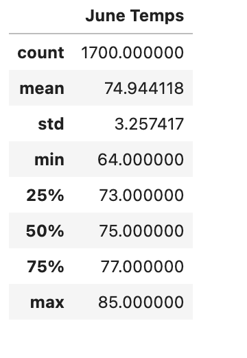
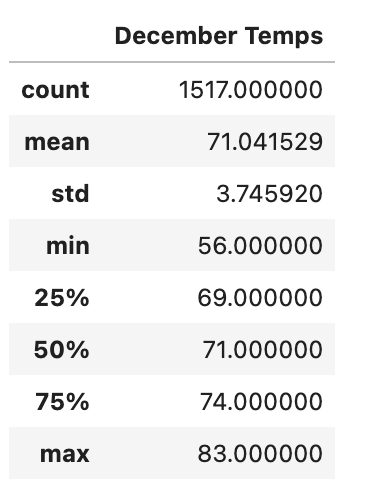

# surfs_up.
## Overview of the analysis
The objective of this analysis was to analyze temperature and weather forecasts to understand whether the surf and turf shop would be profitable considering the weather conditions. In this analysis there are December weather reports and June weather reports to determine whether the shop will remain sustainable and profitable throughout the year. 

## Results

- As you can see in the images above, the mean temperatures between the 2 months are relatively close (4 degrees apart) which brings us to the conclusion that the weather on this island is pleasant around the year. 
- The month June has a larger dataset of 1700 reading compared to December which only had 1517
- June has a min of 64, max of 85 and median 75
- Dec has a min of 56, max of 83 and median 71

## Summary
To help improve the analysis we could calclate the amount of precipatation to understand which location would be best to setup the shop.
We could also find the values of other active areas and see how they correlate to our values. 
